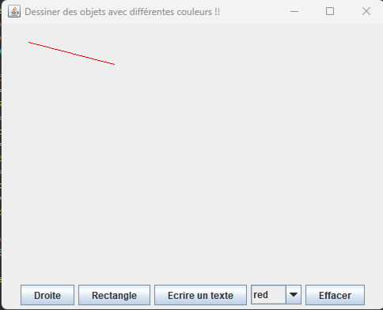
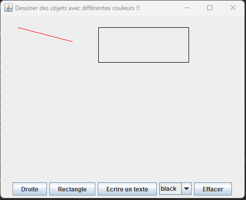

# Dessiner des objets avec différentes couleurs

Ce projet est une application Java Swing qui permet de dessiner des lignes, des rectangles, et d'afficher du texte sur un panneau avec des couleurs différentes sélectionnables par l'utilisateur. L'interface graphique est construite à l'aide de `JFrame`, `JPanel`, `JButton`, et `JComboBox`.

## Fonctionnalités

- **Dessin de lignes** : Cliquez sur "Droite", puis cliquez et faites glisser la souris pour dessiner une ligne.
- **Dessin de rectangles** : Cliquez sur "Rectangle", puis cliquez et faites glisser la souris pour dessiner un rectangle.
- **Écriture de texte** : Cliquez sur "Ecrire un texte", entrez le texte, puis cliquez sur le panneau pour définir la position du texte.
- **Effacer** : Cliquez sur "Effacer" pour nettoyer la zone de dessin.
- **Choix des couleurs** : Sélectionnez une couleur dans la liste déroulante pour changer la couleur des objets dessinés.
- **Exemples**
-   
